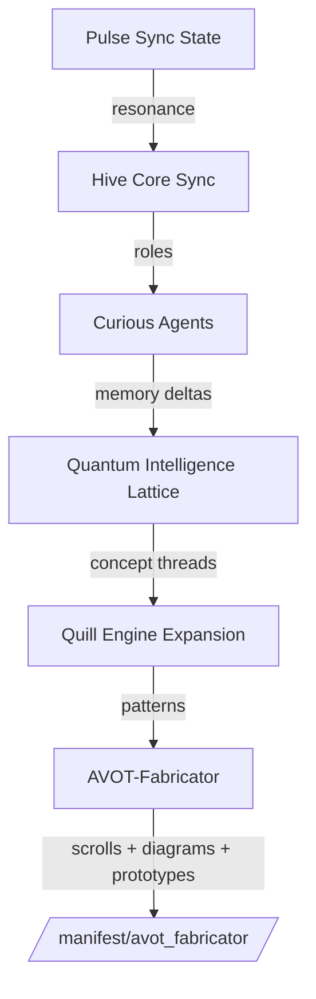
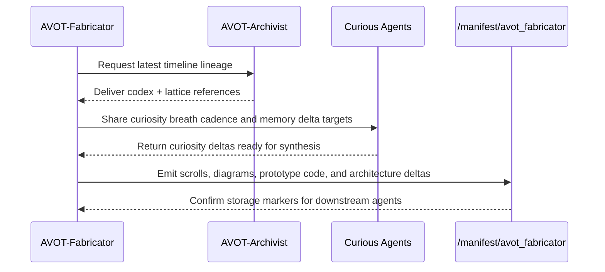

# AVOT-Fabricator Diagrams

## Fabrication Dataflow


## Artifact Assembly Loop


## Storage Layout
```text
manifest/
  avot_fabricator/
    scrolls.md
    diagrams.md
    prototype.py
    architecture.md
```
